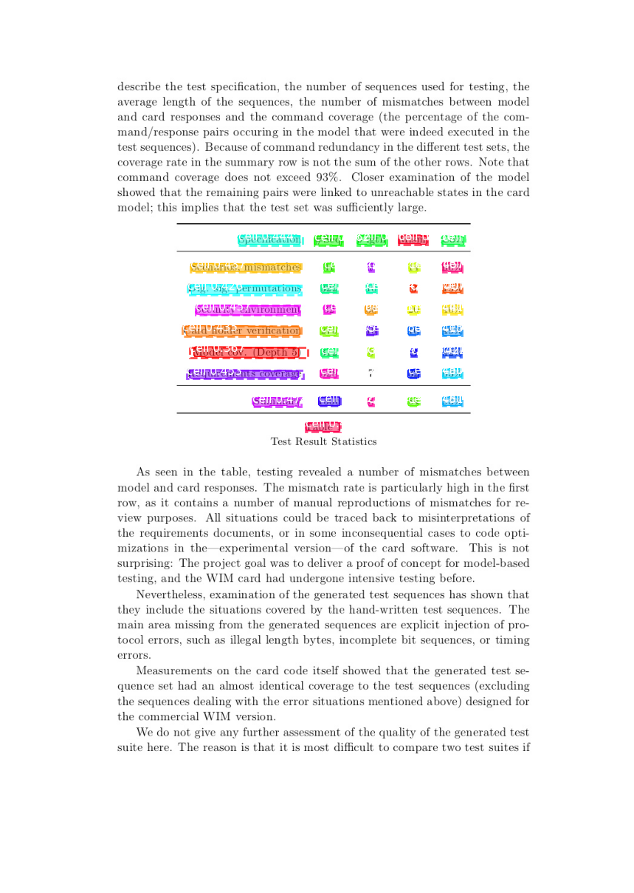
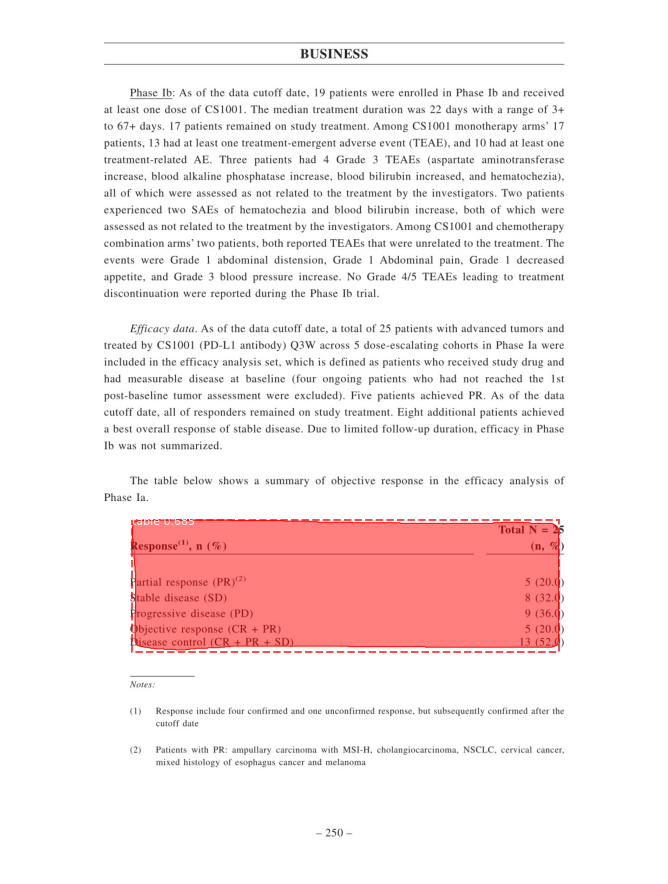

# CoordConv_for_Tabular_Structure_Recognition
This is the code for the System described in the publication:

A. Ambulgekar, N. Lad, K. Doshi and P. Bari, "Using CoordConv for Tabular Data Detection and Structure
Recognition," 2022 International Conference on Computing, Communication, and Intelligent Systems (ICCCIS),
Greater Noida, India, 2022, pp. 587-592, doi: 10.1109/ICCCIS56430.2022.10037664.

This paper explores the usage of CoordConv, the novel upgrade to general convolutional layers in the problem of Tabular Data Detection and Cell-Based Structure Recognition. 
CoordConv has been shown to provide considerably better results in the domain of Object Detection than its counterpart. 
The authors integrate it within the established Anchor optimization approach which leverages guided anchors to accomplish the task of recognizing rows and columns present in tabular data. In contrast to the majority of techniques implemented for Table Structure Recognition, the authors attempt to recognize the cells present in the tabular images instead of the rows and columns. 
They evaluate this method on the coveted ICDAR-19 dataset (International Conference on Document Analysis and Recognition - 2019) which comprises of scanned document images containing tabular regions and achieve results surpassing those of many popular techniques. 
They also apply this approach for the task of Table Detection and achieve results comparable to other established techniques.

* Below are the result images containing the detected cellular and tabular regions.

* Further work would consist extracting the detected image regions and apply OCR for extraction of data to Excel format.

* Given code consists of sample Training, Evaluation and Image Based Detection ipnyb files.
### Table Structure Recognition

### Table Detection

Weights and data can be found at following link: https://drive.google.com/drive/folders/1YAun6x49iWtAIRkM4z3J0PiHZr3NNbCS?usp=sharing
